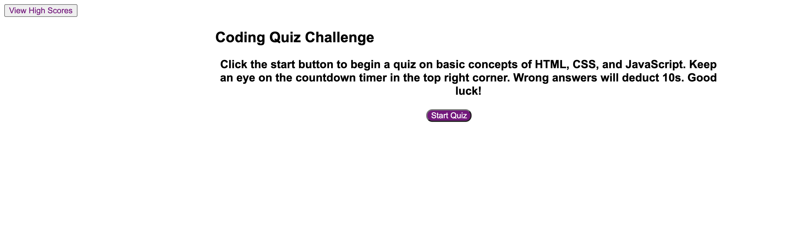

This application features a quiz on basic coding principles that uses HTML, CSS, and JavaScript.

The quiz asks the user a series of questions, features a timer that subtracts time when the user answers a question incorrectly, and displays a high score page that uses local storage to track high scores. 

